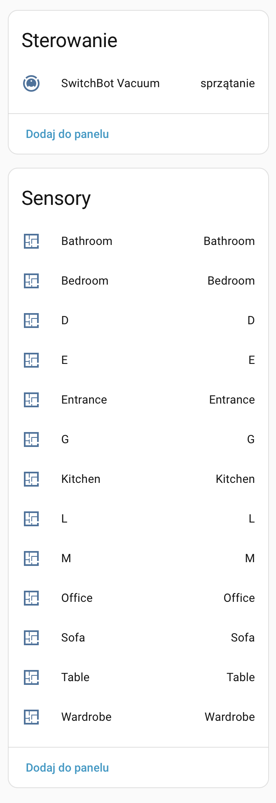
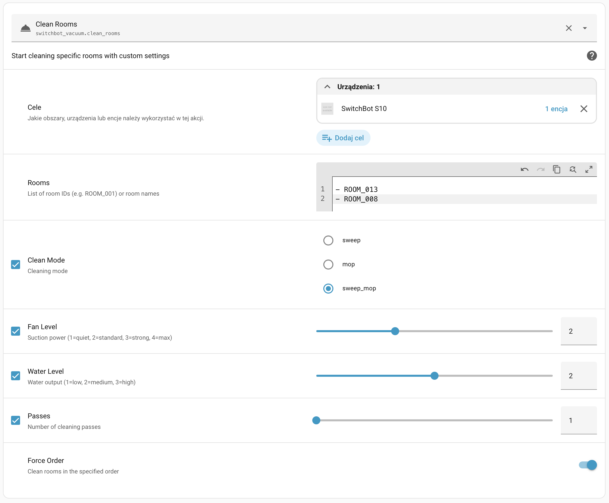
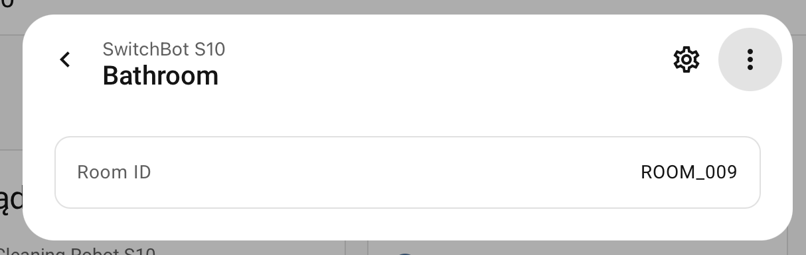

# SwitchBot Vacuum for Home Assistant

Custom [HACS](https://hacs.xyz/) integration for SwitchBot robot vacuums (S10 and compatible models) in Home Assistant.

## Why this exists

SwitchBot does not provide a public API for their robot vacuums. The official SwitchBot integration in Home Assistant does not support vacuum control. This integration uses SwitchBot's internal cloud API (reverse-engineered from the mobile app) to provide full vacuum control, room-aware cleaning, and automatic room name discovery.

## Features

- **Vacuum entity** with full state reporting (cleaning, docked, paused, returning, idle)
- **Room sensor entities** — one per room discovered from the vacuum's map
- **Room-aware cleaning** — clean specific rooms by name or ID, with full control over mode, suction, water level, passes, and order
- **Automatic room discovery** — room names are downloaded from the vacuum's S3 map data every 24 hours
- **Multi-device support** — if your account has multiple SwitchBot vacuums, the config flow lets you pick which one to add
- **Force refresh service** — manually re-download room data and device status on demand

## Installation

### HACS (recommended)

1. Open HACS in Home Assistant
2. Click the three dots menu → **Custom repositories**
3. Add `https://github.com/jaco/switchbot-vacuum` with category **Integration**
4. Search for "SwitchBot Vacuum" and install
5. Restart Home Assistant

### Manual

Copy `custom_components/switchbot_vacuum/` to your Home Assistant `config/custom_components/` directory and restart.

## Configuration

1. Go to **Settings → Devices & Services → Add Integration**
2. Search for **SwitchBot Vacuum**
3. Enter your SwitchBot account email and password
4. If multiple vacuums are found, select the one to add

You can add the integration multiple times for multiple vacuums.

## Screenshots

| Device & room entities | Clean rooms service | Room sensor detail |
|---|---|---|
|  |  |  |

## Entities

### Vacuum

The main entity (`vacuum.switchbot_vacuum`) provides:

| Feature | Description |
|---------|-------------|
| **State** | idle, cleaning, docked, paused, returning |
| **Battery** | Current battery percentage |
| **Fan speed** | quiet, standard, strong, max |
| **Start** | Start full cleaning |
| **Stop / Pause** | Stop or pause current cleaning |
| **Return to base** | Send vacuum to charging station |

#### Extra attributes

The vacuum entity exposes additional attributes you can use in automations and templates:

| Attribute | Example | Description |
|-----------|---------|-------------|
| `water_level` | `1` | Current water output level (1–3) |
| `clean_type` | `sweep_mop` | Current mode: `sweep`, `mop`, or `sweep_mop` |
| `times` | `1` | Number of cleaning passes |
| `last_clean_area` | `45` | Area cleaned in last session (m²) |
| `last_clean_time` | `30` | Duration of last session (minutes) |
| `rooms` | `{"ROOM_013": "Kitchen", ...}` | All known rooms with IDs and names |

**Reading attributes in templates:**

```yaml
# Get battery level
{{ state_attr('vacuum.switchbot_vacuum', 'battery_level') }}

# Get current clean type
{{ state_attr('vacuum.switchbot_vacuum', 'clean_type') }}

# Get last cleaned area
{{ state_attr('vacuum.switchbot_vacuum', 'last_clean_area') }} m²

# List all room names

  {{ name }} ({{ id }})

```

### Room sensors

Each room discovered from the vacuum's map gets a sensor entity (e.g. `sensor.kitchen`, `sensor.bedroom`). The sensor value is the room name, and the `room_id` attribute contains the internal ID (e.g. `ROOM_013`).

```yaml
# Get room ID for use in clean_rooms service
{{ state_attr('sensor.kitchen', 'room_id') }}
```

## Services

### `switchbot_vacuum.clean_rooms`

Clean specific rooms with full control over cleaning parameters.

```yaml
service: switchbot_vacuum.clean_rooms
target:
  entity_id: vacuum.switchbot_vacuum
data:
  rooms:
    - "Kitchen"
    - "Bedroom"
    - "ROOM_003"
  mode: "mop"
  fan_level: 2
  water_level: 2
  times: 1
  force_order: true
```

| Parameter | Required | Default | Values |
|-----------|----------|---------|--------|
| `rooms` | yes | — | List of room names or IDs (can mix) |
| `mode` | no | `sweep_mop` | `sweep`, `mop`, `sweep_mop` |
| `fan_level` | no | `1` | 1 (quiet), 2 (standard), 3 (strong), 4 (max) |
| `water_level` | no | `1` | 1 (low), 2 (medium), 3 (high) |
| `times` | no | `1` | 1 or 2 passes |
| `force_order` | no | `true` | Clean rooms in the specified order |

### `switchbot_vacuum.force_refresh`

Force an immediate refresh of device status and room data (re-downloads the map from S3).

```yaml
service: switchbot_vacuum.force_refresh
target:
  entity_id: vacuum.switchbot_vacuum
```

## Automation examples

### Mop the kitchen every day at 10:00

```yaml
automation:
  - alias: "Daily kitchen mop"
    trigger:
      - platform: time
        at: "10:00:00"
    action:
      - service: switchbot_vacuum.clean_rooms
        target:
          entity_id: vacuum.switchbot_vacuum
        data:
          rooms:
            - "Kitchen"
          mode: "mop"
          water_level: 2
```

### Full clean when everyone leaves

```yaml
automation:
  - alias: "Clean when away"
    trigger:
      - platform: state
        entity_id: group.family
        to: "not_home"
    action:
      - service: vacuum.start
        target:
          entity_id: vacuum.switchbot_vacuum
```

## K10+ room discovery

The K10+ does not expose room names or IDs via the public API. Room IDs are read from the cleaning schedule stored on the robot. To make room entities appear in Home Assistant you need to create at least one schedule with specific rooms selected:

1. Open the SwitchBot app
2. Go to your K10+ → **Schedule**
3. Add a new schedule, select **Clean by Room**, and pick the rooms you want
4. Save the schedule (it can be left **disabled** — it only needs to exist)

The integration reads `smartAreaIds` from all schedules every 24 hours and creates sensor entities named `room0`, `room1`, `room2`, etc. You can also trigger an immediate refresh via the `switchbot_vacuum.force_refresh` service.

Room names are not available through the API — only numeric IDs. To find which ID corresponds to which room, run the robot on a known room using the app and note which ID appears in the schedule.

## K10+ room cleaning — not supported

The K10+ **cannot** clean individual rooms via this integration, even though the SwitchBot app supports it. Here is why:

Room cleaning on the K10+ goes through **Qihoo's proprietary IoT cloud API** (`eu1-sapp-api.botslab.com`), not the standard SwitchBot API. Every request to this API requires a cryptographic `sign` query parameter. The signing algorithm is implemented inside Flutter's AOT-compiled binary (`libapp.so`) and has been extensively reverse-engineered without success:

- Over 50 combinations of MD5, SHA1, SHA256, HMAC-SHA1, and HMAC-SHA256 were tried with inputs including the app key, app secret, timestamp, nonce, auth token, cookie string, device ID, and all URL parameters — all return `{"code":1001,"msg":"Sign error"}`.
- The Dart/Flutter code is compiled to ARM64 machine code with no readable symbols, making static analysis very difficult. The signing logic is buried in 14 MB of code with no accessible source.
- The `sign_ts`, `sign_no`, `appkey`, `m2`, `appver`, `ci_brand`, `ci_model`, `ci_osver`, and `sign` parameters were all identified from APK analysis, but the exact input and order for the hash remain unknown.

Until someone intercepts a valid signed request (e.g. via SSL proxy on a rooted device) or finds the signing formula through further binary analysis, K10+ room-by-room cleaning cannot be implemented.

The `switchbot_vacuum.clean_rooms` service will **not appear** for K10+ devices. Full-house cleaning (`vacuum.start`) works normally.

## Technical notes

- The integration polls the device every 30 seconds
- Auth tokens are refreshed automatically every 1.5 hours
- Room names are refreshed from S3 map data every 24 hours (or on demand via `force_refresh`)
- If AWS credentials for S3 are expired, the integration sends a wake command to the robot and retries after 15 seconds

## License

MIT
